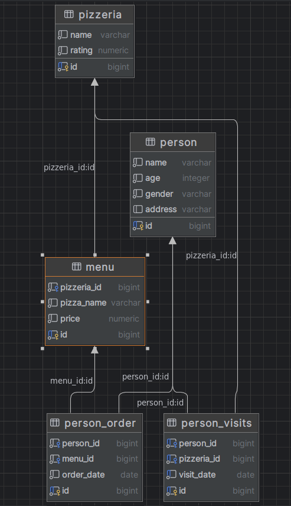

Что бы приступить к выполнению цепочки заданий, необходимо выполнить все инструкции из файла [schema.sql](src%2Fschema.sql).
На картинке ниже, графическое отображение БД и ее связей:

Далее можете приступить к выполнению exercises. Важно выполнять все упражнения и задания в них по порядку!

